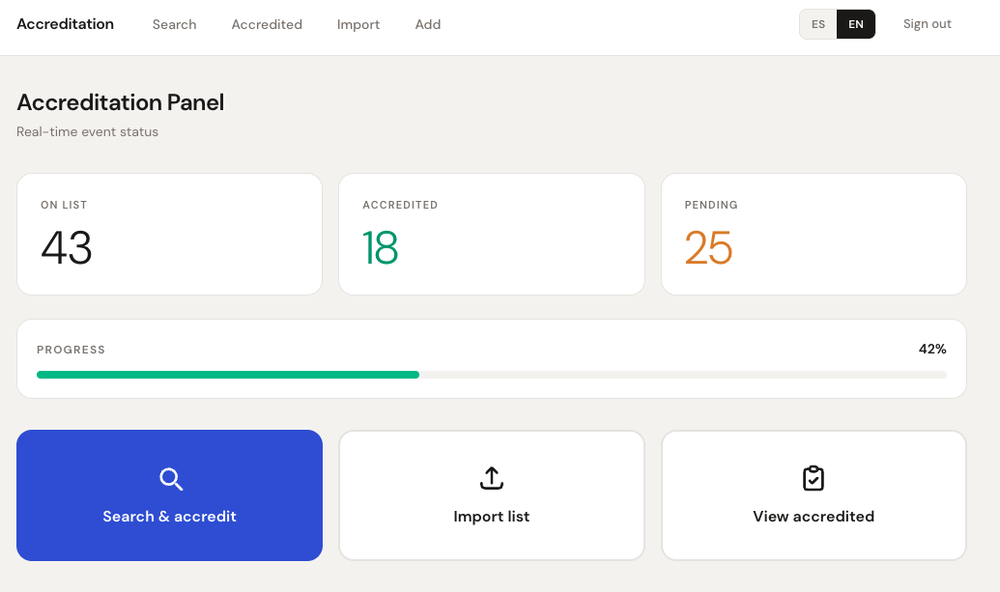
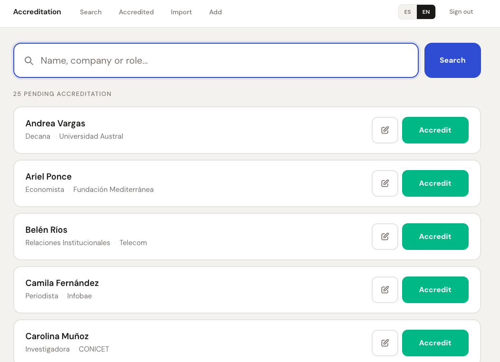
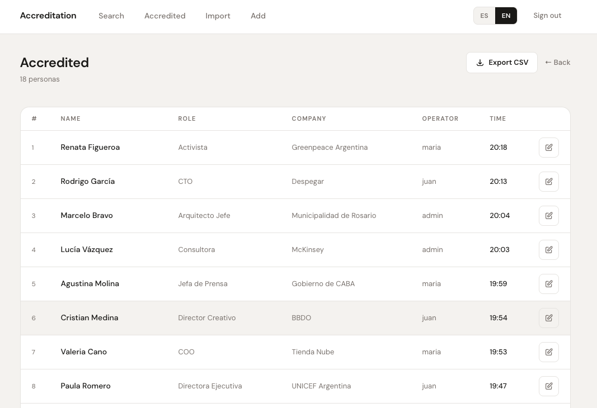
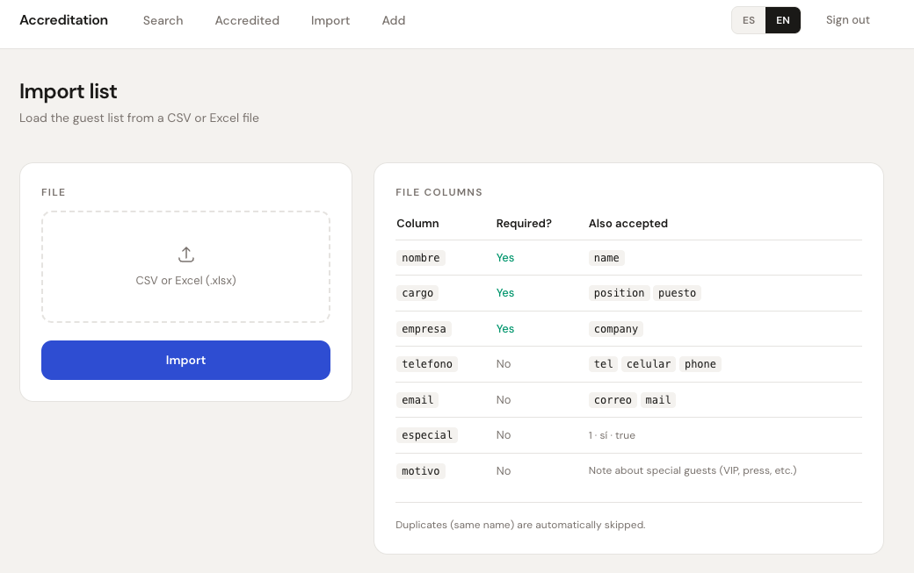
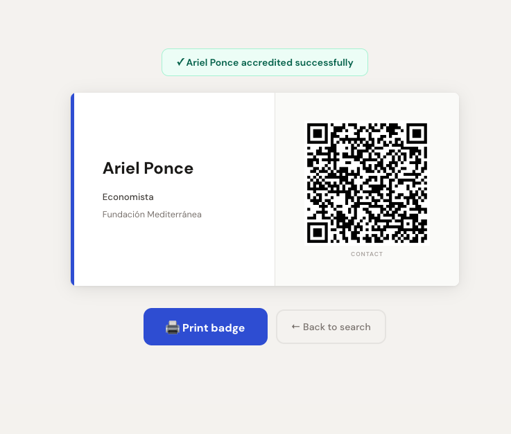

# Accreditation

A professional event accreditation system built with Flask. Designed for tablet use at event entrances — fast guest lookup, one-tap accreditation, and instant printable badges with QR vCard.

---

## Features

### Core
- **Real-time search** — filters by name, company, or role as you type (350ms debounce)
- **One-tap accreditation** — prominent green button, instant confirmation
- **Printable badge** — generated on accreditation: name/role/company on the left, QR vCard on the right (148×74mm, print-ready)
- **Special guests** — flag VIPs with a note; badge accent turns gold and triggers an alert
- **Revert accreditation** — undo mistakes from the search results

### Guest Management
- **Import from CSV or Excel** — bulk load guest lists; supports `nombre`, `cargo`, `empresa`, `telefono`, `email`, `especial`, `motivo` columns (and English equivalents)
- **Export accredited to CSV** — download the full accredited list, Excel-compatible (UTF-8 BOM)
- **Manual entry** — add guests on the fly with all fields including phone and email
- **Edit any record** — update name, role, company, phone, email, special status, and accreditation state

### UX
- **Tablet-first design** — touch targets ≥48px, large inputs (20px text), no hover-only interactions
- **ES / EN toggle** — full bilingual interface, preference stored in session
- **Live stats dashboard** — on-list / accredited / pending counters with progress bar
- **Accredited list** — chronological table of everyone who passed through

---

## Tech Stack

- **Backend**: Python / Flask, SQLAlchemy, SQLite
- **Frontend**: Tailwind CSS (CDN), DM Sans (Google Fonts)
- **QR generation**: `qrcode[pil]` — server-side vCard QR embedded as base64 PNG
- **Import/Export**: `openpyxl` for Excel, stdlib `csv` for CSV

---

## Setup

**1. Clone and install dependencies**
```bash
git clone https://github.com/georgionet/acreditacion.git
cd acreditacion
pip install -r requirements.txt
```

**2. Configure environment** (optional)
```bash
cp .env.example .env
# Edit .env to set SECRET_KEY and ADMIN_PASSWORD
```

**3. Run**
```bash
python app.py
```

Open `http://localhost:5000` and sign in with **admin / admin** (change via `ADMIN_PASSWORD` env var).

---

## Import File Format

| Column | Required | Also accepted |
|--------|----------|---------------|
| `nombre` | ✅ | `name` |
| `cargo` | ✅ | `position`, `puesto` |
| `empresa` | ✅ | `company`, `organización` |
| `telefono` | No | `tel`, `celular`, `phone` |
| `email` | No | `correo`, `mail` |
| `especial` | No | value: `1`, `sí`, `true` |
| `motivo` | No | note for special guests |

Duplicates (same name) are skipped automatically.

---

## Badge Format

Printed at 148×74mm (A6 landscape). Left side shows name, role, and company with a color accent bar (blue for regular guests, gold for special). Right side contains a QR code encoding a vCard 3.0 with full contact details.

---

## Screenshots

### Dashboard
Live stats: total on list, accredited, and pending with a progress bar. Quick-action cards to search, import, or view the accredited list.



### Search & Accredit
Real-time filtering by name, company, or role. Each result shows accreditation status and buttons to accredit or revert.



### Accredited List
Chronological table of everyone who has checked in, with operator and timestamp.



### Import
Upload a CSV or Excel file to bulk-load the guest list. Field mapping is automatic.



### Badge with QR vCard
Printable 148×74mm badge with name/role/company on the left and a QR vCard on the right. Gold accent for special guests.



---

## Environment Variables

| Variable | Default | Description |
|----------|---------|-------------|
| `SECRET_KEY` | `dev-insecure-key` | Flask session secret |
| `ADMIN_PASSWORD` | `admin` | Initial admin password |
| `DATABASE_URL` | `sqlite:///acreditacion.db` | SQLAlchemy database URI |
